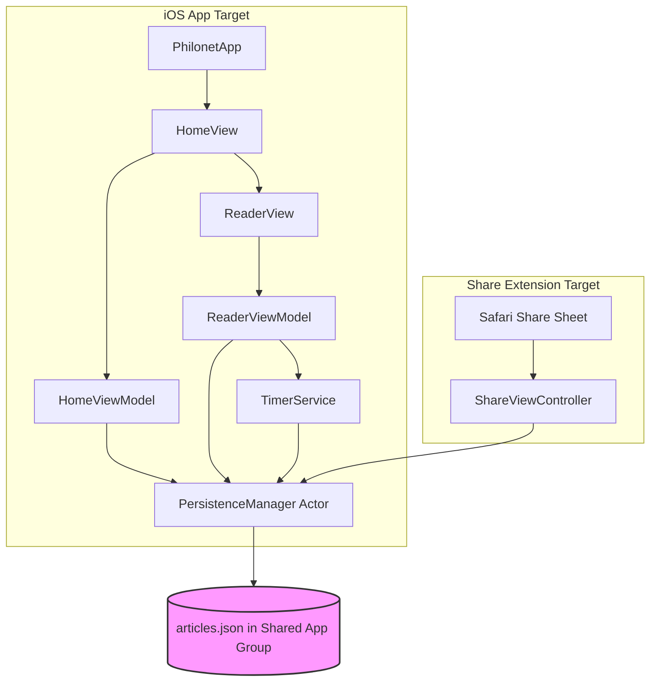
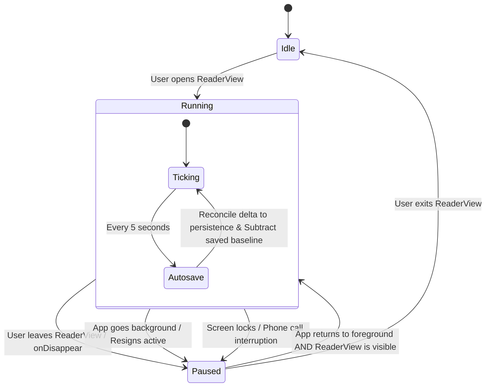
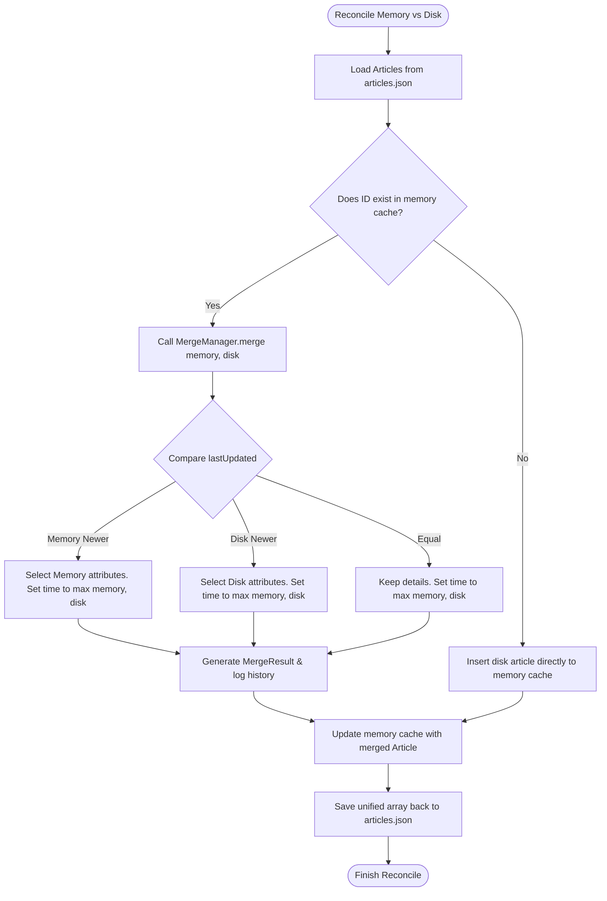

# ReadTrack

A production-quality iOS read-it-later application built for the Philonet Reading Timer assignment.

---

## Demo

https://youtu.be/your-video

---

## Screenshots

| Home | Reader | Debug Panel |
|------|--------|-------------|
| *(add image)* | *(add image)* | *(add image)* |

---

## Features

- **Safari Share Extension**: Instantly share link URLs from Safari into your stack.
- **WKWebView Reader**: Interactive reading view inside the application.
- **Reading Uptime Tracker**: Measures reading session times using monotonic clock reference.
- **Interruption Audits**: Auto-pauses on screen locks, incoming phone calls, background states.
- **Conflict Merge Reconciliation**: Resolves caches with the strict 7-rule merge engine.
- **Live Debug Panel**: Real-time app state audits and an interactive merge playground.
- **JSON Actor Persistence**: Thread-safe background storage using actors and App Groups.

---

## Tech Stack

- **Language**: Swift 5.10
- **UI Framework**: SwiftUI
- **Architecture**: MVVM (Model-View-ViewModel)
- **Engine Concurrency**: Swift Actors (`PersistenceManager`)
- **Reading WebViews**: `WKWebView`
- **Uptime Timing**: Monotonic System Clock
- **Extension Hooks**: Share Extension target
- **Inter-process Sharing**: App Groups container
- **Local Persistence**: Asynchronous Codable JSON

---


## Architecture Diagram

The application is structured using the **MVVM** architecture combined with specialized, decoupled services. The `PersistenceManager` actor acts as the single source of truth for both targets during runtime, utilizing a shared App Group container.



---

## Project Structure

```
Philonet.xcodeproj/          # Xcode project bundle configuration
Philonet/
├── App/
│   └── PhilonetApp.swift    # App lifecycle and main UI injection
├── Models/
│   ├── Article.swift        # Main Article Codable struct
│   └── ReadingSession.swift # Transient tracker for active sessions
├── Services/
│   ├── TimerService.swift        # Monotonic session timer with background listeners
│   ├── PersistenceManager.swift  # Actor-isolated JSON file management
│   └── MergeManager.swift        # Reconciles memory and disk conflicts
├── ViewModels/
│   ├── HomeViewModel.swift  # Search, sort, reload, and delete handlers
│   └── ReaderViewModel.swift # Coordinator for WKWebView and Timer session
├── Views/
│   ├── HomeView.swift        # Dashboard screen with search and sort controls
│   ├── ReaderView.swift      # Article renderer with WKWebView and session toolbar
│   ├── ArticleRow.swift      # Card item for articles in the dashboard list
│   └── DebugPanelView.swift  # Audit logs, active state logs, and playground simulator
├── Utilities/
│   └── FileManager+Helpers.swift # File container helpers
└── Extensions/
    └── Date+Helpers.swift        # Formatter methods for dates
ShareExtension/
├── ShareViewController.swift     # Intercepts links and saves in background
└── Info.plist                     # Extension filters and properties
```

---

## Timer State Transitions

The timer service ensures that time is only recorded during active screen interaction, guarding against locked screens, phone calls, background states, or view swaps.



### How the Timer Works
1. **Monotonic Clock**: The `TimerService` tracks reading duration using `ProcessInfo.processInfo.systemUptime`. This monotonic clock is relative to the device boot time and is immune to user manipulations of the system time (e.g. changing device time back/forth).
2. **Double-Count Prevention**: During a 5-second periodic autosave, the service calculates the elapsed time, updates the article on disk, and subtracts the *exact* amount of saved time from the active session's running count. If the write fails, the accumulated time is retained in memory and retried on the next tick, ensuring no time is ever lost.

---

## Merge Flow & Conflict Resolution

When memory states and disk states mismatch (e.g. from app resume, concurrent Share Extension writes, or recovery from a crash), the engine triggers a conflict reconciliation.



### The 7 Rigid Merge Rules
1. **Compare Timestamps**: `lastUpdated` timestamps are compared.
2. **Newer Wins**: The newer timestamp determines the winner of metadata (title, URL).
3. **Equal Winner**: If timestamps match, the reading time is set to `max(memory, disk)`.
4. **Never Decrease**: The merged reading time is clamped to `max(memory, disk)` under *all* rules, preventing time regression.
5. **No Summing**: Memory and disk durations are never added, avoiding double counting.
6. **Rule Recording**: Every merge generates a `MergeResult` outlining the chosen path and rationale.
7. **Immediate Update**: Autosave updates the `lastUpdated` timestamp immediately after successful persistence to ensure future merges are resolved correctly.

---

## Persistence Strategy & Thread Safety

- **Swift Concurrency**: `PersistenceManager` is implemented as a Swift `actor`. All read/write operations execute on the actor's isolated serial context, eliminating data races or read-write locks.
- **Shared Containers (App Groups)**: The database is written to a shared directory (`group.com.philonet.ReadingTimer`). This allows the Share Extension (which runs in a separate process container) and the main App to access the same `articles.json` file.
- **Fail-safe Fallback**: If App Groups are not provisioned (e.g., standard debug simulator run), it falls back to the App sandbox's `Application Support` directory, guaranteeing the app remains compile-ready out of the box.
- **URL Duplicate Detection**: When adding a new link, if the URL matches an existing article (case-insensitive check), the app updates its title and `lastUpdated` timestamp instead of inserting a duplicate entry.

---

## Share Extension Configuration

To build and run the Share Extension target:
1. Open `Philonet.xcodeproj` in Xcode on macOS.
2. Register an **App Group** named `group.com.philonet.ReadingTimer` in your apple developer console.
3. In Xcode, select the main `Philonet` target and add the **App Groups** capability. Check the box for `group.com.philonet.ReadingTimer`.
4. Select the `ShareExtension` target and add the **App Groups** capability. Check the same box.
5. Build and run the app on a simulator or device. Open Safari, navigate to any page, click **Share**, and tap **Save to Philonet**.

---

## Design Tradeoffs & Future Scope

### Tradeoffs
- **Background Extensions vs Full App Activation**: By default, the Share Extension works in the background (no custom compose sheet) to minimize user friction. The drawback is that users cannot customize titles before saving, although the parser intelligently extracts titles from HTML headers or url naming schemas.
- **No Third-Party DBs**: To avoid external framework bloat, the database uses flat JSON files. While performant for hundreds of articles, SQLite or Core Data could be implemented in future iterations to handle scaling beyond thousands of entries.

### Future Improvements
1. **Cloud Sync**: Integrate iCloud/CloudKit to share article stacks across iPad, Mac, and iPhone.
2. **Reading Speed Statistics**: Track words-per-minute (WPM) by matching scroll velocity inside `WKWebView` with word count.
